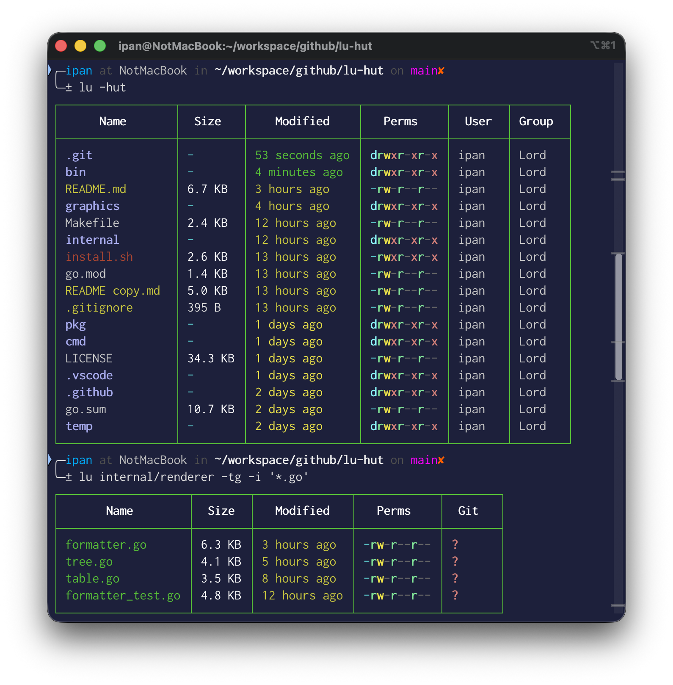
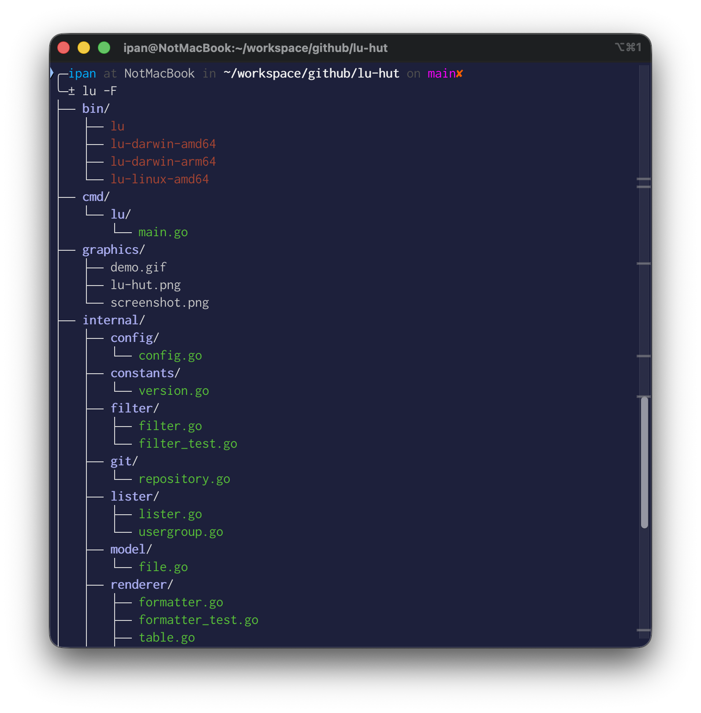

# 🏛️ lu-hut - a powerful modern alternative to the Unix ls command

[](https://github.com/ipanardian/lu-hut/releases)
[](https://go.dev/)
[](https://github.com/ipanardian/lu-hut/blob/main/LICENSE)
[](#)

<p align="center">
  
</p>

`lu -hut` (**L**isting **U**tility) - is a powerful modern alternative to the Unix ls command that delivers directory listings with beautiful box-drawn tables, stunning tree format, intelligent colors, multiple sorting strategies, advanced filtering, and seamless git integration. Transform your file exploration from mundane to magnificent.

---

## 💫 Key Features

- **Beautiful Box-Drawn Tables** - Clean, box-drawn tables with colored borders for excellent readability.
- **Hierarchical Directory Priority** - Folders are prioritized at the top of the list for structured navigation.
- **Stunning Tree View Display (-F)** - Display directory structure in a beautiful tree format with all features supported.
- **Dynamic Git Monitoring (-g)** - Real-time tracking of file states (Untracked, Modified, Added) directly in the table.
- **Time-Aware Color Grading (-t)** - Intelligent color schemes based on file age to quickly identify recent changes.
- **Exact Time Display (-T)** - Show precise modification timestamps instead of relative time.
- **Size-Based Sorting (-S)** - Sort files by size with directories prioritized.
- **Extension-Based Sorting (-X)** - Group files by their extensions for better organization.
- **Transparent Object Visibility (-h)** - Explicit monitoring of hidden files (internal metadata) for complete oversight.
- **Unit Coordination Visibility (-u)** - Detailed User and Group identification to maintain accountability.
- **Advanced Filtering Capability** - Strict inclusion and exclusion logic using glob patterns (`-i`, `-x`).
- **Responsive Terminal Scaling** - Adaptive output that maintains data integrity across different terminal widths.
- **Safe Recursive Listing** - Recursive directory traversal with depth limits and cancellation support.

---

> **"Ingin menjadi Lord sang 'penguasa' terminal? pakailah `lu -hut`"**

---

## 📸 Visual Preview

<p align="center">
    
    
</p>

## 🛠️ Operational Installation

### Quick Install (Recommended)

**macOS and Linux:**

```bash
curl -sSL https://raw.githubusercontent.com/ipanardian/lu-hut/main/install.sh | sudo bash
```

### Build from Source

```bash
$ git clone https://github.com/ipanardian/lu-hut.git
$ cd lu-hut
$ make install
```

Ensure `~/bin` is included in your system `PATH` for seamless execution.

## 📋 Usage Protocol

Execute the `lu` command to begin comprehensive directory monitoring.

```bash
# Standard listing
$ lu

# Git status
$ lu -g

# Sort by modification time (newest first)
$ lu -t

# Sort by size (largest first)
$ lu -S

# Sort by extension
$ lu -X

# Reverse sort order (size)
$ lu -Sr

# Show exact modification time
$ lu -T

# Combine exact time with git status
$ lu -Tg

# Tree view display
$ lu -F

# Tree view with git status
$ lu -Fg

# Tree view with max depth
$ lu -F -L 3

# Tree view with sorting
$ lu -F -S

# List recursive
$ lu -R

# List recursive with max depth
$ lu -R -L 10

# Filtered selection
$ lu -i "*.go" -x "*_test.go"

# Lord mode (Hidden, User, Time Sort)
$ lu -hut

```

## ⚙️ Parameters (Flags)

| Flag   | Long Flag          | Description                                          |
| :----- | :----------------- | :--------------------------------------------------- |
| **-t** | `--sort-modified`  | Sort by modification time (newest first).            |
| **-S** | `--sort-size`      | Sort by file size (largest first).                   |
| **-X** | `--sort-extension` | Sort by file extension.                              |
| **-r** | `--reverse`        | Reverse sort order.                                  |
| **-g** | `--git`            | Show Git status for each file/directory.             |
| **-h** | `--hidden`         | Include hidden files in the listing.                 |
| **-u** | `--user`           | Show User and Group ownership metadata.              |
| **-T** | `--exact-time`     | Show exact modification time instead of relative.    |
| **-F** | `--tree`           | Display directory structure in a tree format.        |
| **-R** | `--recursive`      | List subdirectories recursively.                     |
| **-L** | `--max-depth`      | Maximum recursion depth (0 = no limit, default: 30). |
| **-i** | `--include`        | Include files matching specified glob patterns.      |
| **-x** | `--exclude`        | Exclude files matching specified glob patterns.      |

### 🔄 Sorting Priority

When multiple sorting flags are specified, the priority order is:

1. **Size** (`-S`) - Highest priority
2. **Extension** (`-X`)
3. **Modified Time** (`-t`)
4. **Name** (default) - Lowest priority

Only one sorting mode is active at a time.

### 💡 Pro Tips Like a "Lord"

- Use `-T` for precise timestamps when auditing file changes
- Combine `-S` with `-r` to find smallest files first
- Use `-X` to group files by type for better organization
- Tree view supports all flags including git status, sorting, and filtering
- Recursive listing respects all filters and sorting options
- Press `Ctrl+C` during recursive listing to cancel safely

### ⚖️ Legal Disclaimer

This software is an independent, open-source technical utility designed for directory management and data visualization. It does not represent the views of the author, nor do they imply any affiliation with, endorsement by, or intent to disparage any public figures. This tool is 100% functional and is provided as-is for professional use. Users are responsible for their own interpretation and application of this software.

### 📄 License

GNU General Public License v3.0 - Copyright protected by Lord.

**Key Points of GPL v3:**

- **Freedom to Use**: You are free to use, run, and modify this software for any purpose.
- **Freedom to Distribute**: You are free to redistribute this software in its original or modified form.
- **Copyleft Requirement**: Any fork or derivative of this repository **MUST** use the same GPL v3 license.
- **Author Attribution**: You **MUST NOT** remove the author name from credits or copyright statements.
- **Source Access**: If you distribute this software (in modified form), you must provide access to the source code.
- **License Compatibility**: This software can only be combined with software that has a GPL v3-compatible license.
